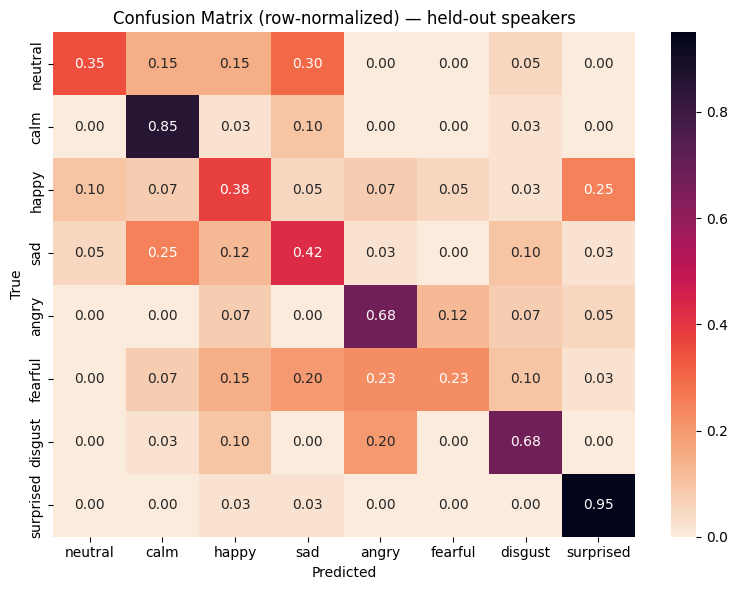
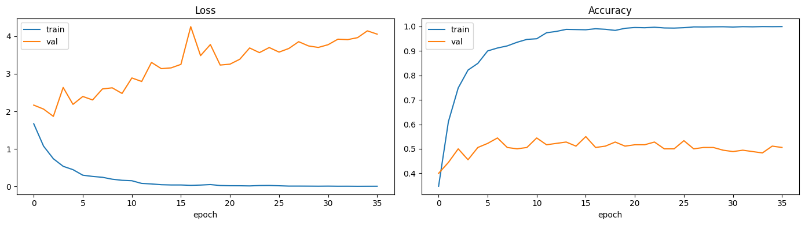

# 🎤 Speech Emotion Recognition

A CNN + BiLSTM + attention model that classifies emotion from short speech
clips, trained on the RAVDESS dataset with a **speaker-independent
train/test split** — evaluated on five actors the model never heard during
training, not a random shuffle that leaks voice identity into the test set.

**[Try the live demo →](https://your-streamlit-url-here.streamlit.app)**
*(update this link once redeployed)*

---

## Results

| | |
|---|---|
| Test accuracy (5 held-out speakers) | **58.0%** |
| Random-guess baseline (8 classes) | 12.5% |
| Train / val / test samples | 3,840 / 180 / 300 |
| Test actors | Actor_20–24 (never seen in training) |



**Per-class performance:**

| Emotion | Precision | Recall | F1 |
|---|---|---|---|
| surprised | 0.73 | 0.95 | 0.83 |
| calm | 0.63 | 0.85 | 0.72 |
| angry | 0.56 | 0.68 | 0.61 |
| disgust | 0.66 | 0.68 | 0.67 |
| sad | 0.45 | 0.42 | 0.44 |
| neutral | 0.54 | 0.35 | 0.42 |
| happy | 0.39 | 0.38 | 0.38 |
| fearful | 0.56 | 0.23 | 0.32 |

## Why 58%, and why that's the honest number

A random 80/20 split on this dataset routinely reports 80-90%+ accuracy —
but that number is inflated: RAVDESS has each of 24 actors read the same two
sentences across all 8 emotions, so a random split puts the *same voice*
in both train and test. The model partly learns to recognize **who** is
speaking rather than **what emotion** they're expressing, and that
shortcut doesn't exist when a stranger uses the live demo.

This project splits by actor instead — actors 1–19 for train/val, actors
20–24 held out entirely for test — so the reported 58% reflects genuine
generalization to a new voice. For context, published RAVDESS results using
correct speaker-independent evaluation typically fall in the 50-65% range,
so this is in line with the literature rather than an inflated demo number.



The gap between ~100% train accuracy and ~55% validation accuracy is
overfitting on a small dataset (1,440 clips is not a lot for a sequence
model) — expected, and the reason `EarlyStopping` + `ModelCheckpoint`
restore the best validation-epoch weights rather than the final epoch's.

## Error analysis

Reading the confusion matrix, the mistakes aren't random — they cluster
around emotions that share similar pitch and energy signatures:

- **happy → surprised** (25% of happy clips): both are high-arousal,
  high-pitch-variance emotions in acted speech: without visual cues, "wow!"
  and an excited "yes!" sound acoustically similar.
- **sad → calm** (25% of sad clips): both are low-arousal, low-energy —
  the acoustic difference between "sad" and "subdued" is subtle.
- **fearful → angry/disgust** (23%/20%): all three are negative,
  higher-energy emotions; fearful is the weakest class overall (23% recall),
  and its confusion spreads across three different classes rather than one,
  suggesting the model hasn't found a clean acoustic signature for it.
- **neutral → sad** (30%): both are low-energy/low-pitch-variance; neutral
  also has fewer training samples than other classes (RAVDESS has no
  "strong intensity" neutral variant), which likely compounds this.
- **surprised** and **calm** are the strongest classes (95% and 85%
  recall) — both sit at the extremes of arousal, which is apparently the
  easiest axis for the model to separate on.

This points to arousal (energy/pitch variance) being an easier signal for
the model to pick up than valence (positive/negative) — it can tell
"excited" from "flat" more reliably than "happy-excited" from
"surprised-excited."

## Architecture

```
Input (130 time steps × 141 features)
  → Conv1D(128) → BatchNorm → ReLU → Dropout → MaxPool
  → Conv1D(128) → BatchNorm → ReLU → Dropout
  → Bidirectional LSTM(64, return_sequences=True)
  → Attention (learned weighting over time steps)
  → Dense(64, ReLU) → Dropout
  → Dense(8, softmax)
```

**Features** (per 512-sample frame, ~130 frames per 3-second clip):
40 MFCCs + delta + delta-delta (120 dims), 12-bin chroma, 7-band spectral
contrast, zero-crossing rate, RMS energy — 141 features per time step.
Unlike averaging MFCCs into a single vector (the common approach for this
dataset), keeping the time axis lets the CNN+BiLSTM learn how emotional
tone changes *within* an utterance rather than treating the whole clip as
one static snapshot.

**Attention** lets the model learn which frames matter most for the
prediction, instead of weighting the whole clip equally — the live demo
visualizes this over the waveform.

**Augmentation** (train split only, applied after the speaker split to
avoid leakage): additive noise, pitch shift (±2 semitones), time stretch
(0.85–1.15×) — each training clip becomes 4 variants (original + 3
augmented).

## Tech stack

| | |
|---|---|
| **TensorFlow / Keras** | CNN + BiLSTM + attention model |
| **Librosa** | Audio loading, resampling, feature extraction |
| **scikit-learn** | Feature scaling, label encoding, evaluation metrics |
| **Streamlit** | Web interface |
| **Plotly / Matplotlib** | Probability chart, attention-over-waveform visualization |

## Project structure

```
├── app.py                      # standalone Streamlit app (loads model directly)
├── backend/
│   ├── main.py                 # FastAPI app — /predict, /health
│   ├── inference.py            # model loaded once at startup, not per-request
│   └── schemas.py              # typed request/response models
├── frontend/
│   └── streamlit_app.py        # thin client — calls the backend API instead of loading the model
├── src/
│   ├── feature_extraction.py   # shared by training + both inference paths — single source of truth
│   └── model_def.py            # model architecture (rebuilt + weights loaded, see note below)
├── model/
│   ├── emotion_model.h5        # trained weights
│   ├── scaler.pkl              # StandardScaler, fit on train split only
│   ├── label_encoder.pkl
│   ├── feature_config.json     # exact audio/feature params used at train time
│   └── metrics_summary.json
├── notebooks/
│   └── Emotion_Recognition_v2_training.ipynb
├── Dockerfile.backend / Dockerfile.frontend / docker-compose.yml
└── assets/
```

A note on `emotion_model.h5`: the app rebuilds the architecture from
`src/model_def.py` and calls `load_weights()` rather than
`load_model()` on the full saved file. The attention block uses a Keras
`Lambda` layer, which newer Keras versions won't automatically
deserialize from a saved config for security reasons — rebuilding from
code sidesteps that cleanly, and is exactly as correct since it's the
identical architecture that produced the checkpoint.

## Running locally

```bash
git clone https://github.com/<your-username>/speech-emotion-recognition.git
cd speech-emotion-recognition
```

**Option 1 — single Streamlit app (simplest):**
```bash
pip install -r requirements.txt
streamlit run app.py
```

**Option 2 — decoupled backend + frontend (Docker):**

A FastAPI backend serves predictions over a REST API (`/predict`, `/health`), loading the model once at startup rather than per-request; the Streamlit frontend is a thin client that calls it over HTTP. This is the architecture behind `backend/` and `frontend/`.

```bash
docker compose up --build
```
- Frontend: http://localhost:8501
- Backend interactive docs: http://localhost:8000/docs

Or run each side without Docker, in two terminals:
```bash
# terminal 1
pip install -r backend/requirements.txt
uvicorn backend.main:app --reload

# terminal 2
pip install -r frontend/requirements.txt
streamlit run frontend/streamlit_app.py
```

## Limitations & future work

- Trained on **acted** emotional speech; real-world spontaneous speech
  tends to be subtler and would likely need domain adaptation or
  fine-tuning on a naturalistic dataset (e.g. IEMOCAP, CREMA-D).
- Fearful and happy are the weakest classes — a two-stage classifier
  (arousal first, then valence within each arousal band) is a natural next
  experiment given the error pattern above.
- No multimodal signal — combining with facial expression or text
  transcript would likely resolve several of the acoustic-similarity
  confusions described above.
- FastAPI backend + Docker deployment in progress (see project board /
  open issues).

## Dataset & license

Trained on [RAVDESS](https://zenodo.org/record/1188976) (Livingstone &
Russo, 2018), licensed CC BY-NA-SC 4.0. This repository's code is licensed
under the MIT License (see `LICENSE`).
